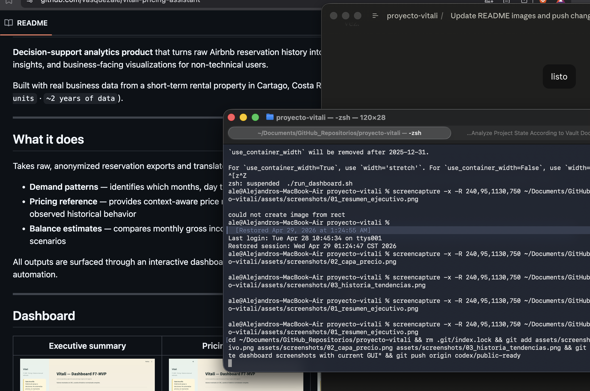
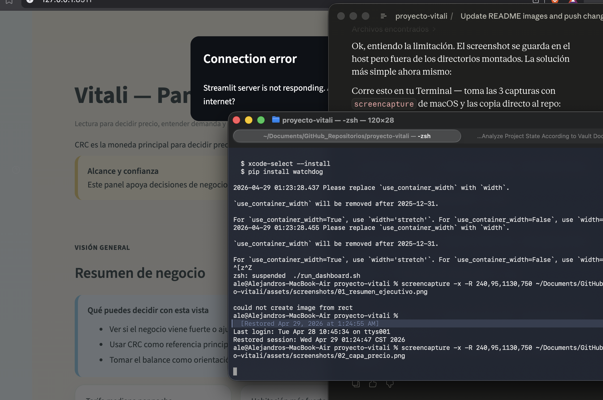
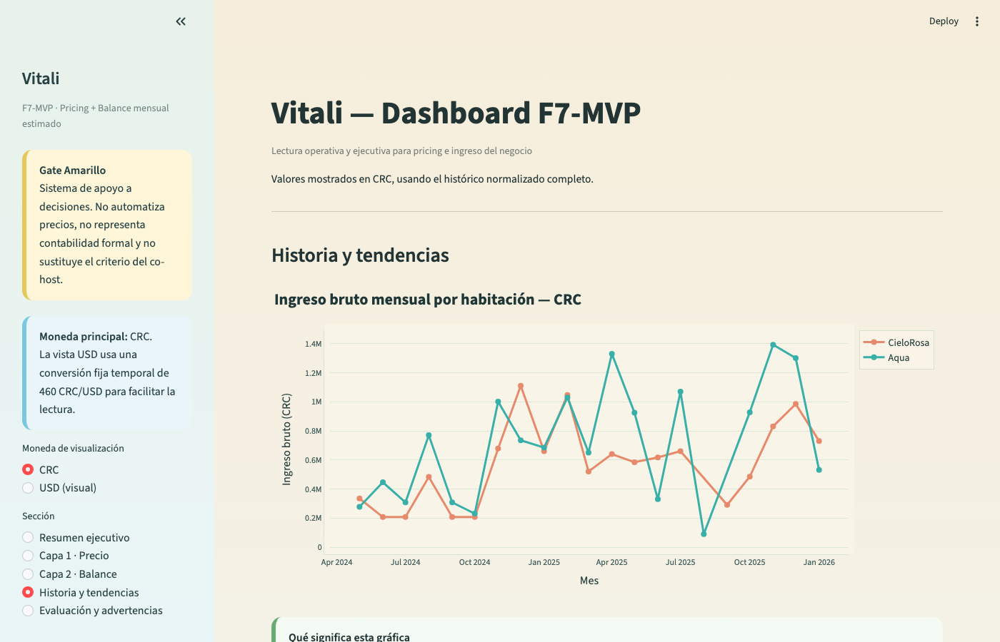

# Airbnb Demand & Pricing Analytics

**End-to-end data analytics pipeline** that turns raw reservation data from an Airbnb property into actionable pricing decisions — delivered through an interactive dashboard designed for non-technical users.

Built with real business data from a short-term rental property in Cartago, Costa Rica (296 reservations · 2 units · ~2 years of data).

---

## What it does

Takes raw, anonymized reservation exports and produces three business outputs:

- **Demand patterns** — identifies which months, days, and unit types drive the most revenue, with statistical support behind every claim
- **Pricing reference** — context-aware price ranges by unit, month, and weekday vs. weekend, based on observed historical rates
- **Balance estimates** — monthly gross income vs. estimated expenses across three cost scenarios, with forward projections

All outputs are available through an interactive dashboard that requires zero technical knowledge to use.

---

## Dashboard

| Executive Summary | Pricing Reference | Demand Heatmap |
|---|---|---|
|  |  |  |

The dashboard has five views:

- **Executive Summary** — key metrics at a glance: median daily rate, top-performing unit, peak month, total reservations, income trend, and projected balance
- **Pricing Reference** — select unit, month, and day type to get an observed price range with historical support count; compare against a custom price
- **Monthly Balance** — income vs. estimated expenses with three cost scenarios; projected forward balance curve
- **History & Trends** — income evolution over time, average daily rate by unit, and a reservations heatmap
- **Model Evaluation** — rolling-forward validation results for the baseline pricing model

---

## Key findings

- **Weekend check-ins command ~22% higher daily rates** than weekday check-ins (CRC lane)
- **Room B consistently outperforms Room A** by ₡8,000 CRC / $35 USD in median daily rate
- **Peak demand concentrates in April** (domestic market) and **December** (international market)
- Advance bookings of 31+ days correlate with slightly higher rates — an actionable pricing lever

---

## Stack

| Layer | Tools |
|---|---|
| Data processing | Python · pandas · NumPy |
| Modeling | scikit-learn · statistical baseline |
| Dashboard | Streamlit · Plotly |
| Testing | pytest · TDD throughout |
| Environment | uv · pyproject.toml |

---

## Run it locally

```bash
# 1. Clone and install dependencies
git clone https://github.com/vasquezale/vitali-pricing-assistant.git
cd vitali-pricing-assistant
uv sync

# 2. Launch the dashboard
uv run streamlit run src/vitali/dashboard/app.py
```

> The app loads from local data files (gitignored for privacy). The dashboard structure, pipeline logic, and all analytical code run without any external API or cloud dependency.

---

## Project structure

```
src/vitali/
  data/        — loaders, validators, cleaning pipeline
  dashboard/   — Streamlit app, Plotly chart factories
  mvp/         — pricing and balance business logic
  models/      — baseline model and sklearn utilities
tests/         — full pytest suite (TDD)
scripts/       — reproducible pipeline scripts
artifacts/     — tracked analytical outputs
configs/       — YAML configuration
```

---

## Privacy

Real reservation data is anonymized and gitignored. Only aggregated artifacts and production code are committed to this repository.
