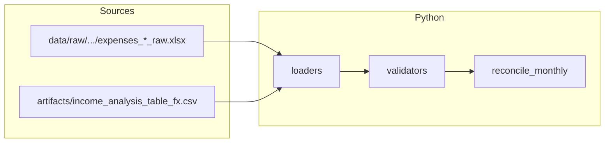

# Proyecto Vitali

**Pricing assistant and decision support system** for an Airbnb property in Cartago, Costa Rica.

> Analyzes historical reservation data to identify pricing patterns, seasonality, and profitability segments — then delivers actionable recommendations backed by evidence.

## Status

This repo implements a **pipeline**, not an automatic pricing engine.

### Current state (methodological gate: **Yellow**)

- **Product scope**: decision support (ranges + evidence), **not** automatic optimization.
- **Gate**: **Yellow** (insufficient economic integration for strong profitability claims).
- **Recent technical phases**:
  - **F3** data preparation to deterministic `parquet` lanes (**completed**)
  - **F4** EDA snapshot artifacts (**completed**)
  - **F5** baseline heuristic (rules-first) (**completed**)
  - **F6** rolling-forward evaluation (**completed**)
- **F7** (dashboard / executive report): **active / started**, but must remain conditioned by the Yellow gate constraints.

### Yellow gate implications (what we do / do not claim)

- **No clean P&L**: we do **not** present defensible net profitability per reservation (fees/payout/costs are not reconciled at that level).
- **CRC vs USD lanes**:
  - **CRC** is the most useful lane as an **orientative reference** (per Phase 6 results).
  - **USD** has **high uncertainty** and must be communicated with explicit warnings.
- **FX policy**:
  - The repo provides a **reproducible technical mechanism** for FX normalization inputs.
  - The **economic/business policy** (which FX rates to adopt and why) is **not closed** yet.

## Repo vs Vault

This repository is intentionally limited to **practical, executable project assets**:

- production code,
- tests,
- configuration,
- scripts,
- lightweight artifacts needed for delivery.

Project context, research, agent coordination, prompts, and living documentation are kept in the private vault outside the repository.

## Privacy and Data Handling

- Real Airbnb exports, guest data, sanitized datasets, and intermediate datasets must stay under `data/` and are never committed.
- Secrets, local credentials, and personal tooling files must stay in ignored locations such as `.env`, `secrets/`, or repo-local excludes.
- If a file should help other collaborators without exposing secrets, commit a safe template such as `.env.example` instead of the real file.

## What `data/raw/` Means Here

`data/raw/` does **not** mean “more private data must exist somewhere else”.
It means the real source files you already have should be copied into a stable,
ignored, repo-local structure so scripts can reference them reproducibly.

Recommended local layout:

```text
data/
  raw/
    financials/
      FINCA VITALI _ Contabilidad Administrativa _ 2025.xlsx
      FINCA VITALI _ Contabilidad Administrativa _ 2026.xlsx
    airbnb/
      Ingresos_Vitali_ingresos_anonimizados.csv
```

The files stay local and gitignored. The value is reproducibility, not publication.

## Quick Start

```bash
# Setup environment
uv sync
uv sync --extra dev

# Run quality checks
bash scripts/run_quality_checks.sh

# Run full test suite
uv run pytest
```

## Critical artifact: `artifacts/income_analysis_table_fx.csv`

This CSV is a **hard dependency** for Phase 2 (monthly pipeline) and Phase 3 (FX join + deterministic lanes).

- **Artifact**: `artifacts/income_analysis_table_fx.csv`
- **Official producer**: `scripts/build_income_analysis_table_fx.py`
- **Technical contract (canonical path + minimal schema)**: `src/vitali/contracts/artifacts.py`
- **Contract test**: `tests/contracts/test_income_fx_producer.py`

Important: the producer enforces **explicit FX inputs** (so we do not “invent” rates). This makes the mechanism reproducible while keeping the **FX economic policy** explicitly **open**.

## Phase 2 — monthly data pipeline (Yellow gate)

Under the **methodological Yellow gate** (see vault `evidence/phase-2-gate-decision` and `research/02_data_viability`), the repo ships a **minimal reproducible pipeline**:

- `vitali.data.loaders` — expenses from `data/raw/{year}/expenses_{year}_raw.xlsx` (full intake) and income from `artifacts/income_analysis_table_fx.csv` (CRC columns, optional year filter).
- `vitali.data.validators` — `DataQualityReport` with blocking errors vs advisory alerts (e.g. months with very few bookings).
- `vitali.data.pipeline` — `reconcile_monthly` joins **monthly** gross income CRC (by `check_in` month) with **monthly** expense CRC (by `fecha` month). This is an **indicative** cash view, not audited P&L or per-reservation profitability.



Run focused tests (with coverage on the pipeline modules only):

```bash
uv run pytest tests/data/ -q --cov=vitali.data --cov-fail-under=80
```

## Minimal operational commands (existing entrypoints)

Run these from the repo root.

```bash
# Quality + tests
bash scripts/run_quality_checks.sh
uv run pytest

# Build the critical FX analysis table (writes artifacts/income_analysis_table_fx.csv)
uv run python scripts/build_income_analysis_table_fx.py

# Phase 3: deterministic datasets (writes data/sanitized/* and data/interim/*)
uv run python scripts/prepare_phase3_datasets.py

# Phase 4: EDA snapshot artifacts (writes artifacts/eda/*)
uv run python scripts/eda_phase3_income.py

# Phase 5: baseline heuristic metrics (writes artifacts/baseline/phase5_metrics.json)
uv run python scripts/baseline_rules_phase5.py

# Phase 6: rolling-forward evaluation (writes artifacts/evaluation/phase6_rolling_metrics.json)
uv run python scripts/rolling_forward_phase6.py
```

## Reproducible Income Analysis Base

The project now includes a minimal reproducible path for the anonymized income extract.

1. Place the local CSV at `data/raw/airbnb/Ingresos_Vitali_ingresos_anonimizados.csv`
   or pass a custom path with `--input`.
2. Generate a compact JSON profile:

```bash
uv run python scripts/profile_income_data.py \
  --input /absolute/path/to/Ingresos_Vitali_ingresos_anonimizados.csv \
  --output artifacts/income_profile.json
```

This step validates the extract, parses dates, preserves the mixed `USD` / `CRC`
context, and emits a profile segmented by currency and room identifier.

To generate a more analytical descriptive summary:

```bash
uv run python scripts/summarize_income_data.py \
  --input /absolute/path/to/Ingresos_Vitali_ingresos_anonimizados.csv \
  --json-output artifacts/income_summary.json \
  --markdown-output artifacts/income_summary.md
```

This summary stays within the current project guardrails: it is descriptive and
reproducible, but it is not a substitute for profitability modeling, market
analysis, or a formal Fase 2 gate.

To build a reservation-level analysis table for downstream EDA:

```bash
uv run python scripts/build_income_analysis_table.py \
  --input /absolute/path/to/Ingresos_Vitali_ingresos_anonimizados.csv \
  --output artifacts/income_analysis_table.csv
```

This table preserves original currency by default and does not invent exchange
rates. If you later decide on explicit normalization inputs, you can pass them
deliberately:

```bash
uv run python scripts/build_income_analysis_table.py \
  --input /absolute/path/to/Ingresos_Vitali_ingresos_anonimizados.csv \
  --output artifacts/income_analysis_table.csv \
  --fx-rates-json '{"USD":510.0,"CRC":1.0}'
```

The same policy can be declared in `configs/base.yaml` under `fx_normalization`.
The recommended default for the current phase is:

- `enabled: false`
- `strategy: preserve_original`

Only switch to `manual_static` when you have explicitly chosen and documented
the rates you want to use for comparison in CRC.

To generate an aggregated summary that keeps `currency` as a mandatory grouping
axis for monetary metrics:

```bash
uv run python scripts/summarize_income_segments.py \
  --input /absolute/path/to/Ingresos_Vitali_ingresos_anonimizados.csv \
  --json-output artifacts/income_segment_summary.json \
  --markdown-output artifacts/income_segment_summary.md
```

This is the recommended next step under the current official policy
`preserve_original`, because it allows totals and medians by segment without
accidentally mixing `USD` and `CRC`.

To derive reproducible narrative insights from those segments:

```bash
uv run python scripts/generate_income_segment_insights.py \
  --input /absolute/path/to/Ingresos_Vitali_ingresos_anonimizados.csv \
  --json-output artifacts/income_segment_insights.json \
  --markdown-output artifacts/income_segment_insights.md
```

These insights are generated from the segment summary itself. They are meant to
reduce manual reading of raw tables, not to replace deeper business validation.

To generate quick visual diagnostics of how income behaves over time by room:

```bash
uv run python scripts/plot_income_trends.py \
  --input /absolute/path/to/Ingresos_Vitali_ingresos_anonimizados.csv \
  --output-dir artifacts/income_trends
```

This produces:

- `charts/`: PNG charts for monthly reservations, gross income, median ADR, and month/context ADR
- `tables/`: CSV support tables for the plotted series
- `reports/`: compact Markdown and JSON summaries for fast reading

Keep in mind that the charts still respect the current `preserve_original`
currency policy, so `USD` and `CRC` are shown separately.

## Reproducible Expense Analysis Base

The repo now also includes a minimal reproducible path for the accounting
workbooks used as the expense source of truth.

1. Copy the real workbooks into `data/raw/financials/`, or pass explicit paths
   with repeated `--input` flags.
2. Generate a compact profile:

```bash
uv run python scripts/profile_expense_data.py \
  --input "/absolute/path/to/FINCA VITALI _ Contabilidad Administrativa _ 2025.xlsx" \
  --input "/absolute/path/to/FINCA VITALI _ Contabilidad Administrativa _ 2026.xlsx" \
  --output artifacts/expense_profile.json
```

This step does **not** solve cost allocation or net profitability. It only gives
the project a reproducible expense intake layer so Fase 2 does not start from
Markdown summaries alone.

## Safe Publication Flow

```bash
# 1. Work from the public-safe branch
git switch codex/public-ready

# 2. Run quality checks
bash scripts/run_quality_checks.sh

# 3. Run the pre-push security review
bash scripts/pre_push_security_check.sh
```

Create the first GitHub remote from `codex/public-ready`, never from `main`.

## Project Structure

```
src/vitali/     — Production code
tests/          — Pytest test suite
configs/        — YAML configuration
scripts/        — Operational scripts and quality checks
artifacts/      — Lightweight tracked artifacts only
data/           — Local-only datasets (gitignored)
```

## Methodology

CRISP-DM adapted with a **data viability gate** — if the data doesn't support ML, the project delivers analytical rules and descriptive insights (still valuable).
